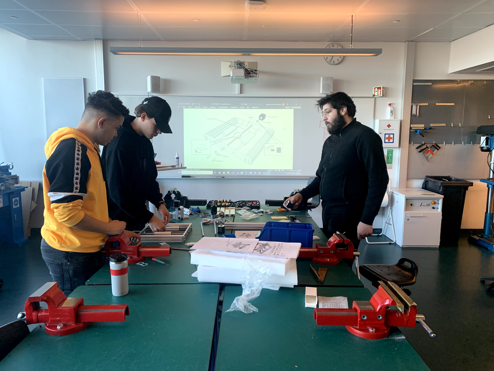

# Datorstyrt fresemaskin 3018 MAX CNC på Kuben vidergående skole

Her finns informasjon om skolens CNC fres.
* [Informasjon om fresen](README.md#informasjon-om-fresen)
* [Bruk av fresen](README.md#bruk-av-fresen)
* [Montering og service](README.md#montering)

* [Besøk skolens nettsted https://kuben.vgs.no/](https://kuben.vgs.no/)
* [Kuben videregående skole på github https://github.com/KubenKoder](https://github.com/KubenKoder)
* [Link til denne side på github pages https://kubenkoder.github.io/CNC-fres-3018/ ](https://kubenkoder.github.io/CNC-fres-3018/)

## Informasjon om fresen

Denne datorstyrte fresemaskinen (CNC) med et horisontellt arbeidsområde på 30*18cm står nå i 3-etagen-elektroverkstedet, innre rommmet. Den er tenkt til å bli bruk til å gi introduksjon til operasjon av CNC-freser til elevene og for å lage prototyper av kretskort med. Den kan frese i treverk, plastik og kretskort (uten glassfiber). 

Maskinen er en generisk no-name "3018 CNC" fra kina og ble kjøpt fra aliexpress for 3801 NOK inklusive frakt og moms. [Kvittering](CNC_order.pdf) og [link til webb-butikk](https://www.aliexpress.com/item/1005001728210352.html). Denne modell av CNC blir salgt av mange ulike fassonger fra ulike leverantører og återforselgere på internet, typisk fra kina. Denne ble valgt for at den var 100% metall og vi håper at det gjør den litt mer robust.

Den styres av [grbl](https://github.com/gnea/grbl/wiki) software og en dedikert handkontroller med SD-kort-læser. Den kan også styres direkte fra en USB-tilkoblet PC med progam som [Universal Gcode Sender](https://winder.github.io/ugs_website/) som gir deg mulighet at styre den med mobiltelefon eller bruke mer avanserte funksjoner som automatisk probing og overflatekompensasjon. 

## Bruk av fresen

Vi har ennå ikke laget en Kuben specifik brukermanual og den er ikke helt ferdigmontert så om noen ønsker å bruke den så er det best om man bruker tiden på at ferdigstille de resterende punkterne under "Montering".

[Tillverkerens Brukermanual PDF](Manualer/User_manual.pdf)

### Installing the USB driver
Last ned [USB driver CH341SER_(2019)](CH341SER_(2019).EXE) og installer, om den sier "Install failed" så er den allerede installert.

### Lage filer for kretskortfresing

Tegne kretskort i [KiCad](https://kicad.org/) eller [Fritzing](https://fritzing.org/) (lag bruker og logg in for å laste ned fritzing)

Lage fresebaner i [FlatCAM](http://flatcam.org/)

### Lage filer for 3D-fresing i tre eller plastik

Tegne 3D modell i [Fusion360](https://www.autodesk.com/products/fusion-360) i *design* modus og lage fresebaner i *manufacture* modus, bruk innebygget GRBL postprocessor for at eksporte verktøybaner.

## Montering

### Monterings crew fra 2DE 2020-2021:

Maskinen blev påbegynt montering 22.04.2021 av disse eleverne fra data og elektronikk: 

* Noah
* Bryan
* Mats
* Ferdinand

Video som viser montering av en lignende maskin.

[Assembly manual PDF](Manualer/User_manual.pdf)

[3D Modell av nesten samme fres ](cnc-router-3018-black-1.snapshot.3.zip) 
[Hentet fra GrabCAD](https://grabcad.com/library/cnc-router-3018-black-1)

## Kvar at montere

Det mangler fortsatt noe trinn for fresen er enkel å bruke, noen er viktigere en andre. Denne liste bør deles opp i kategorier og prioritets-rekkefølge.

* Rubber feet. Tregner T-nuts og skruer, 3D printe? Alternativt drille nye hull og gjenge. Ikke så vanskelig
* Montere endebryter i alle rettninger og koble sammen kablene så de aktiverer samtidig (sjekk NO / NC). Mangler festepunkter, kabler og bryter. Prøv å ikke redusere arbeidsområdet unødvendig og ikke la maskinen knuse bryterne. Krever en hel del jobb og besluttninger. Induktive sensorer kan brukes men kommer med samme utfordringer. De bør festes godt så de holder posisjonen, serskild om de er mekaniske. Aktiver Hard-limits i GRBL når de funker.
 * Teste om vi kan bruke homeing med kontrollen, gjennom at ha en fil med homeing-sequence. 
* Stramme stop-skruer, skuffen manger riktig størrelse på verktøy. Trenger en 1,5mm umbrako. Stramme serskilt stopskruen ved Y-axis knotten. 
* Koble inn en nødstop i serie med anslutning og montere denn ovenpå fresen. Det finnes 2 t-nuts som passer i sporen som kanskje kan brukes.
* Sett på en skilt om at det er krav på briller og hørselvern og at det er risikofyllt å stikke inn fingrerne. Sikkerhetsanalyse bør gjøres når vi lager kursmaterial for nybegynnere.
* Designe og printe en holder for hankontrollen. Rekommendert plassering horisontellt på X-axis motoren med tilgang til knapper og SD-kort. Vurder om den festes permanent eller i enkelt klikke-feste. Vurder at motoren kommer at utvikle mye værme og kan mye opp plastiken.  
* Lage en Z-probe. Teste først med multimeter, har kortet pull-up/down og sjekke konduktivitet gjennom spindle, er den koblet til motor-ground? Krever: kabler, 2*0.1" header, crocodile clip(?) og en probe-plate/tilblingsmetode for kretskortet.
* Fres en lomme for kretskort i en bit materiale på en kjent plassering fra endestoppene. 
* Lage et materiallager med tilkappte og godkjente emner.
* Lage en festemetode for alle godkjente emnestørrelser.
* Lage kursmateriale som tekst og video for bruk av maskinen. Gjerne flere små videos som viser ulike trinn så kan de enkelt byttes ut når noe endres.
* Lenke inn guide til hvordan man tegner kretskort og andre ting for fresing.
* Mulig ide, skyv Y-axis lagerholder fra hverandre for å minske slerk. 

[Back to top](https://kubenkoder.github.io/CNC-fres-3018/)
