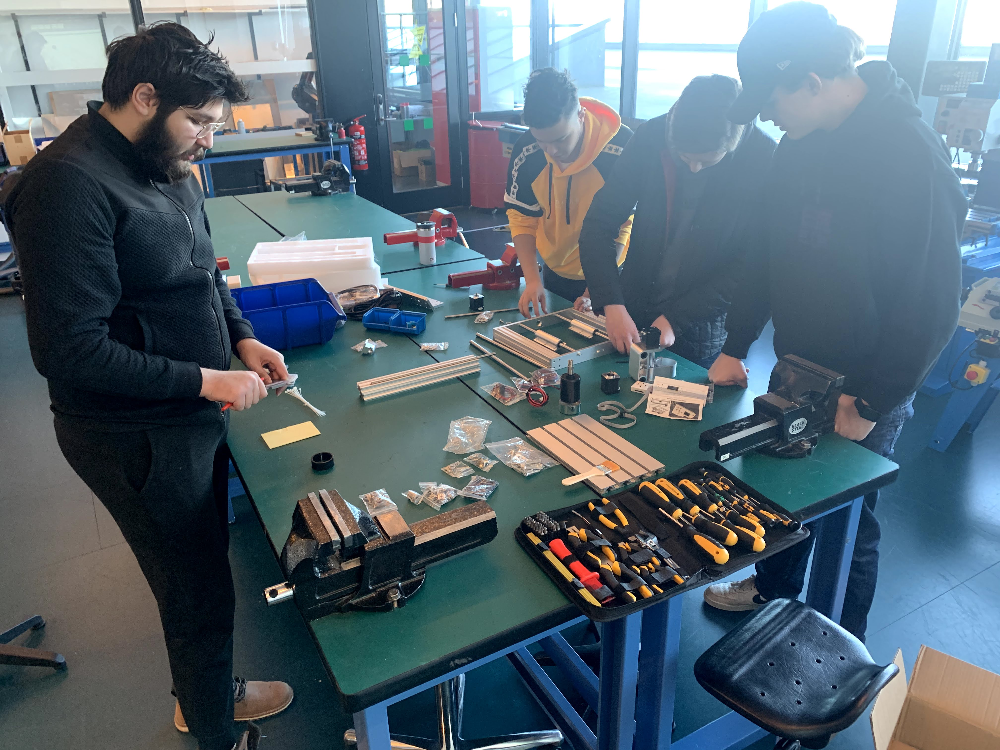

# Datorstyrt fresemaskin 3018 MAX CNC

## Bruk av fresen

[Brukermanual PDF](Manualer/User_manual.pdf)

### Installing the USB driver
Last ned [USB driver CH341SER_(2019)](CH341SER_(2019).EXE) og installer, om den sier "Install failed" så er den allerede installert.

### Lage filer for kretskortfresing

Tegne kretskort i [KiCad](https://kicad.org/) eller [Fritzing](https://fritzing.org/) (lag bruker og logg in for å laste ned fritzing)

Lage fresebaner i [FlatCAM](http://flatcam.org/)

### Lage filer for 3D-fresing i tre eller plastik

Tegne 3D modell i [Fusion360](https://www.autodesk.com/products/fusion-360) i *design* modus og lage fresebaner i *manufacture* modus.

## Montering

### Monterings crew fra 2DE 2020-2021:

Maskinen blev påbegynt montering 22.04.2021

* Noah
* Bryan
* Mats
* Ferdinand

[Assembly manual PDF](Manualer/User_manual.pdf)